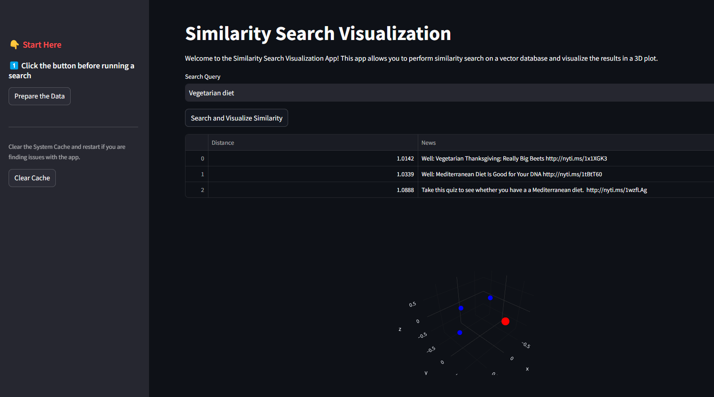

# Similarity Search Visualization

This project provides a Streamlit web application that visualizes similarity searches performed on a vector database (ChromaDB). It allows users to input a query, search for similar documents, and visualize the results in a 3D plot.

.jpeg)

## Table of Contents

-   [Features](#features)
-   [Demonstration](#demonstration)
-   [Getting Started](#getting-started)
    -   [Prerequisites](#prerequisites)
    -   [Installation](#installation)
    -   [Running the App](#running-the-app)
    -   [Usage](#usage)
-   [Code Explanation](#code-explanation)
    -   [Helper Functions](#helper-functions)
    -   [Streamlit App](#streamlit-app)
-   [Project Structure](#project-structure)
-   [Streamlit App Page](#streamlit-app-page)
-   [Dependencies](#dependencies)
-   [Author](#contributing)
-   [License](#license)

## Features

-   **Data Preparation:** Loads and prepares sample health news data for vectorization.
-   **Vector Database Integration:** Connects to ChromaDB for storing and querying vector embeddings.
-   **Similarity Search:** Performs similarity searches based on user queries.
-   **3D Visualization:** Visualizes the query and search results in a 3D scatter plot using PCA for dimensionality reduction.
-   **Cache Management:** Provides a button to clear the ChromaDB system cache.

## Demonstration

<table>
  <tr>
    <td width="50%"></td>
    <td width="50%"></td>
  </tr>
</table>

## Getting Started

### Prerequisites

- Python 3.8+ (recommended 3.12)
- `chromadb` >=0.6.3
- `datasets` >=3.3.2
- `ipykernel` >=6.29.5
- `numpy` >=2.2.3
- `pandas` >=2.2.3
- `pinecone[grpc]` >=6.0.1
- `plotly` >=6.0.0
- `qdrant-client` >=1.13.3
- `sentence-transformers` >=3.4.1
- `streamlit` >= 1.43.2

### Installation

1.  Clone the repository:

    ```bash
    git clone <repository_url>
    cd <repository_directory>
    ```

2.  Install the required packages:

    ```bash
    pip install streamlit chromadb pandas plotly scikit-learn sentence-transformers torch
    ```

3.  Download the sample data:

    Place the `healthnews.json` file in the same directory as the `streamlit_app.py` script.

### Running the App

1.  Start the Streamlit app:

    ```bash
    streamlit run streamlit_app.py
    ```

2.  Open the app in your web browser at the displayed URL (usually `http://localhost:8501`).

### Usage

1.  **Prepare Data:** Click the "Prepare the Data" button in the sidebar to load and prepare the sample health news data. **This step is essential before performing any searches.**
2.  **Enter Query:** Type your search query in the "Search Query" text input.
3.  **Search and Visualize:** Click the "Search and Visualize Similarity" button to perform a similarity search and display the results in a 3D plot.
4.  **Clear Cache:** If you encounter any issues, click the "Clear Cache" button in the sidebar to clear the ChromaDB system cache and restart the app.

## Code Explanation

### Helper Functions

-   `reduce_dimensions(vectors)`: Reduces the dimensionality of vector embeddings from 384 to 3 using Principal Component Analysis (PCA). This is for plotting purposes.

### Streamlit App

-   The app initializes Streamlit, sets the page configuration, and creates a sidebar for user interactions.
-   The "Prepare Data" button loads the sample data, connects to ChromaDB, creates a collection, and adds the data to the collection.
-   The "Search and Visualize Similarity" button performs a similarity search based on the user's query and visualizes the results in a 3D plot using Plotly.
-   The "Clear Cache" button clears the ChromaDB system cache.

## Project Structure

similarity-search-visualization/
├── streamlit_app.py
├── healthnews.json
└── README.md

-   `streamlit_app.py`: The main Streamlit application script.
-   `healthnews.json`: Sample health news data in JSON format.
-   `README.md`: This documentation file.

## Streamlit App Page

Go to this page to access the deployed app: https://similarity-srch.streamlit.app/

## Author

This project was developed by Gustavo R Santos.<br>
[Linkedin](https://www.linkedin.com/in/gurezende/)<br>
[Website](https://gustavorsantos.me)


## License

Project licensed under MIT License.